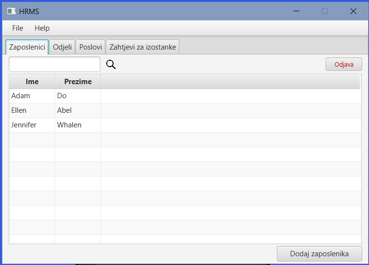
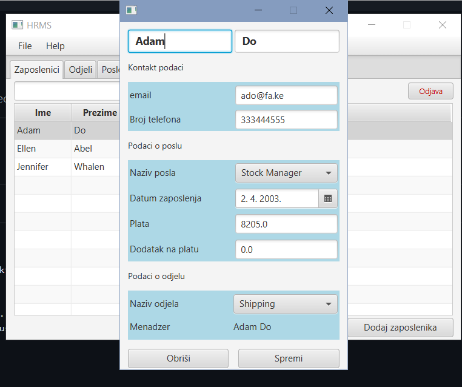
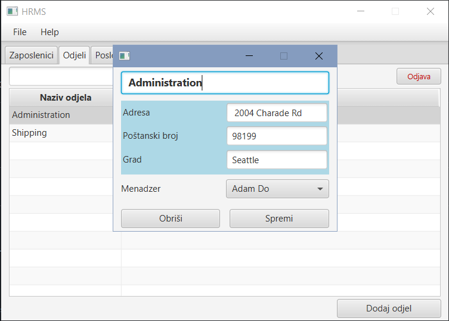
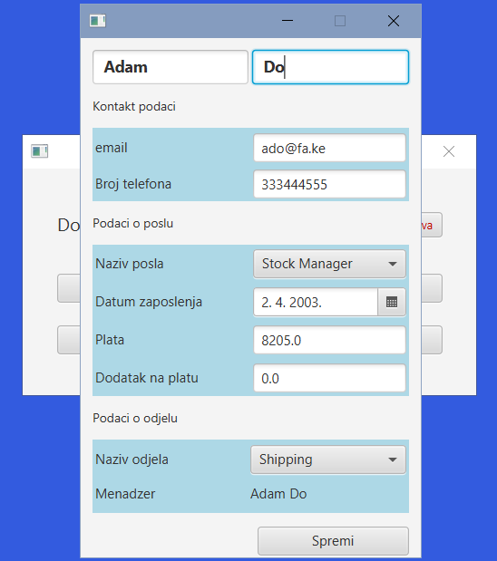
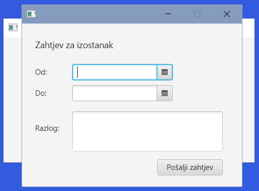

# Human Resources Management System

Human Resources Management System simple desktop app built in Java. 

### Application functionalities
User can have *administrator* or *employee* role.  

* After a successful login as an *administrator*, user can manage the system that is organized in four tabs: *employees, departments, jobs and leave requests.*  
Administrator can view, add, edit and delete employees, departments and jobs. He can search through each table using search bar. 
He can also accept or refuse leave requests that are being requested by employees. By choosing the option of getting a JasperReport on the main menu, where all accepted employees leaves are listed.  

   
   
   

* When the *employee* logs in, he can view and edit his profile, and send a leave request. 

   
   

### Built using
[][java]
[][javafx]
[][SQLite]
[][jasperreports]

[java]: https://www.java.com/en/
[SQLite]: https://www.sqlite.org/index.html
[javafx]: https://openjfx.io/
[jasperreports]: https://community.jaspersoft.com/
